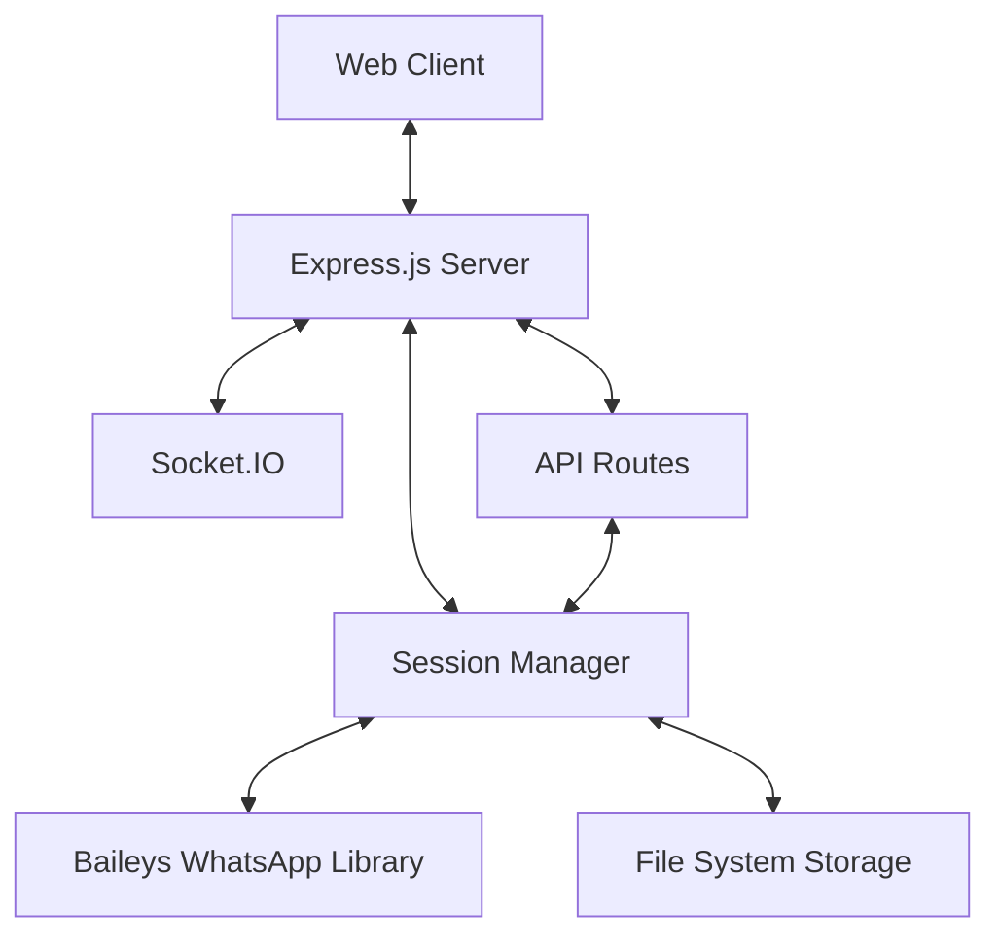
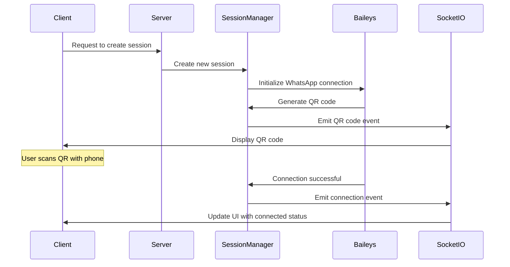
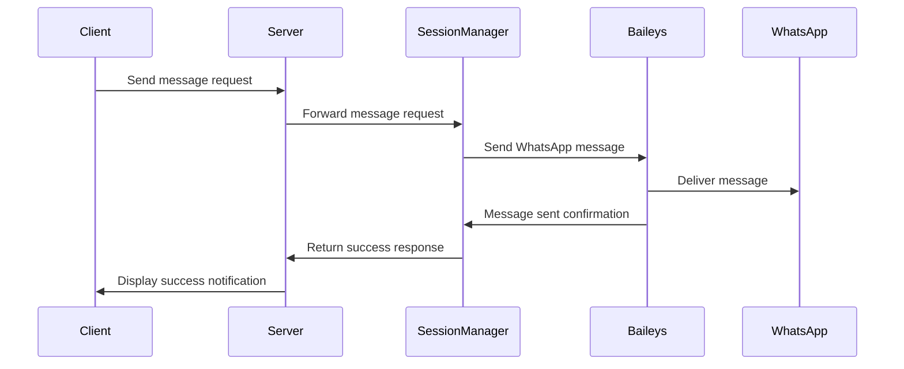

# WhatsApp Gateway System Patterns

## System Architecture

The WhatsApp Gateway follows a modular architecture with clear separation of concerns:

### Key Components

1. **Express.js Server**
   - Serves as the main application server
   - Handles HTTP requests and responses
   - Renders EJS templates for the web interface
   - Manages middleware and routing

2. **Session Manager**
   - Core component that manages WhatsApp sessions
   - Handles session creation, authentication, and deletion
   - Manages message sending and scheduling
   - Maintains session state and persistence

3. **Socket.IO Integration**
   - Provides real-time communication between server and clients
   - Broadcasts session status updates and QR codes
   - Enables live updates without page refreshes

4. **Baileys WhatsApp Library**
   - Underlying library for WhatsApp Web API interaction
   - Handles WhatsApp protocol and authentication
   - Manages connections and message sending

5. **File System Storage**
   - Stores session data and authentication credentials
   - Maintains scheduled message information
   - Provides persistence across server restarts

## Design Patterns

### Singleton Pattern
- The Session Manager is implemented as a singleton to ensure a single instance manages all WhatsApp sessions.
- Created once at application startup and shared across routes.

### Factory Pattern
- The `createSessionManager` function acts as a factory that creates and configures the session manager.
- Encapsulates the complexity of setting up the session manager with all its dependencies.

### Observer Pattern
- Socket.IO implements the observer pattern for real-time updates.
- Clients subscribe to events (e.g., QR code updates, connection status) and receive notifications when those events occur.

### Middleware Pattern
- Express middleware is used to inject the session manager into request objects.
- Allows routes to access the session manager without direct dependencies.

### Repository Pattern
- Session data is stored and retrieved using a repository-like pattern.
- Abstracts the storage mechanism (file system) from the business logic.

## Data Flow

### Session Creation Flow

### Message Sending Flow

## Technical Decisions

### Using Baileys Library
- **Decision**: Use the @whiskeysockets/baileys library for WhatsApp integration.
- **Rationale**: Provides a reliable, well-maintained implementation of the WhatsApp Web protocol without requiring an official API key.
- **Trade-offs**: Depends on unofficial API which may change, but offers more flexibility than official Business API.

### File-Based Session Storage
- **Decision**: Store session data in the file system.
- **Rationale**: Simple to implement, doesn't require additional database setup, and works well for the expected scale.
- **Trade-offs**: Limited scalability compared to a database, but sufficient for small to medium deployments.

### Socket.IO for Real-Time Updates
- **Decision**: Use Socket.IO for real-time communication.
- **Rationale**: Provides reliable bidirectional communication with fallbacks for different environments.
- **Trade-offs**: Adds complexity compared to simple HTTP requests, but necessary for real-time features.

### EJS Templating
- **Decision**: Use EJS for server-side rendering.
- **Rationale**: Simple syntax, good integration with Express, and sufficient for the application's UI needs.
- **Trade-offs**: Less feature-rich than some alternatives, but keeps the stack simple.

### Node-Cron for Scheduling
- **Decision**: Use node-cron for message scheduling.
- **Rationale**: Lightweight, easy to integrate, and provides cron-like scheduling capabilities.
- **Trade-offs**: In-memory scheduling doesn't scale across multiple servers, but appropriate for the current architecture.
